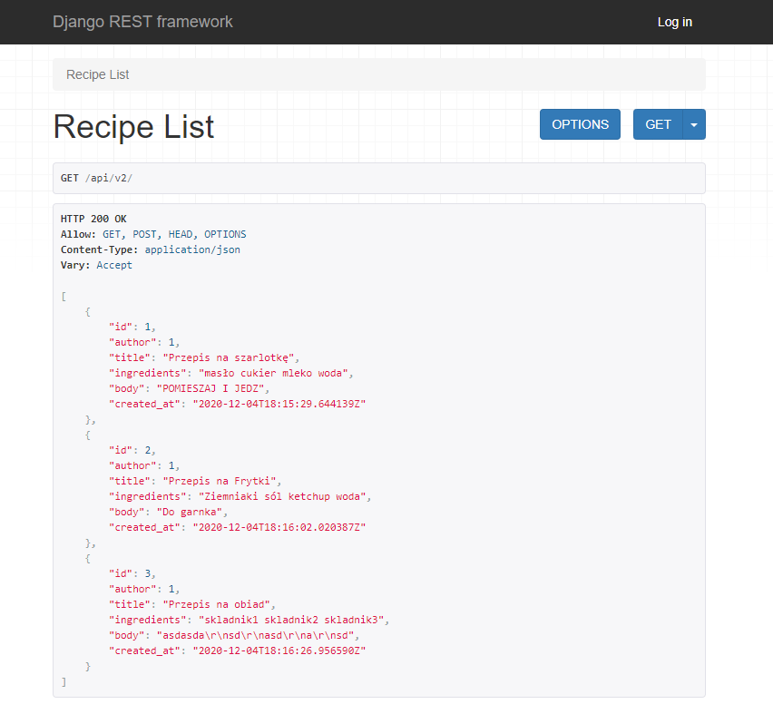
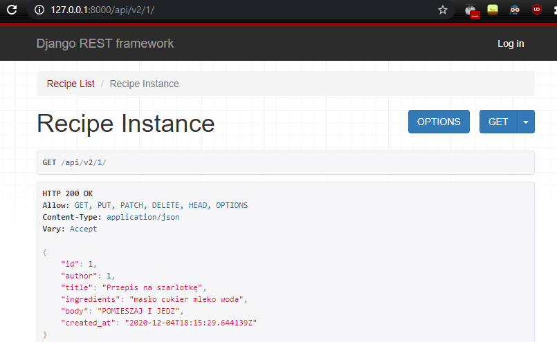
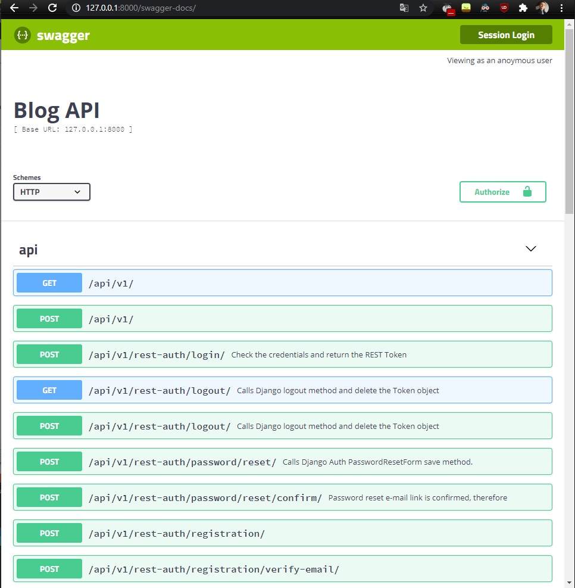

# Aplikacje Internetowe

## LAB4 REST API z DRF

- Stworzyłem Blog Api używając Django Res Framework
- Stworzyłem dokumentacje APi za pomocą Swaggera i  OpenApi
- Stworzyłem API v2 z aplikacją RECIPES 

Przemyślenia:
- Swagger jest przestarzały należy używać drf-yasg
- W django tworzenie Api jest zaskakująco szybkie i proste
- Wersjonowanie API jest proste

